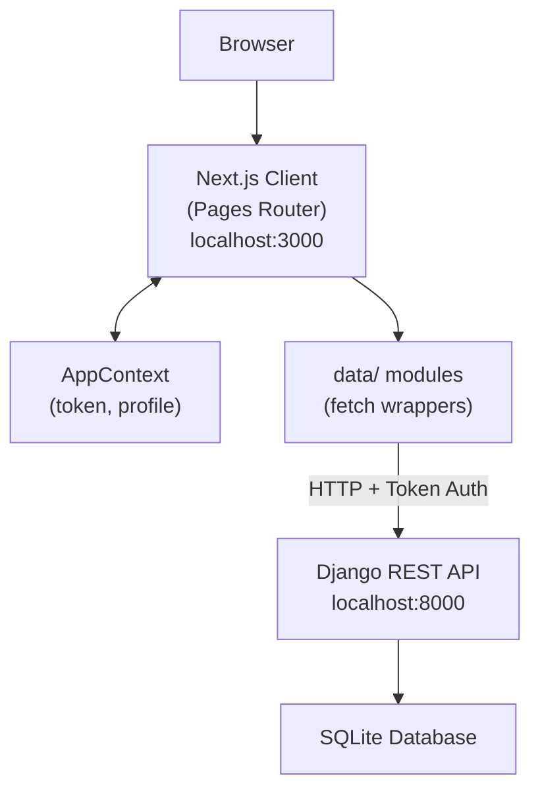
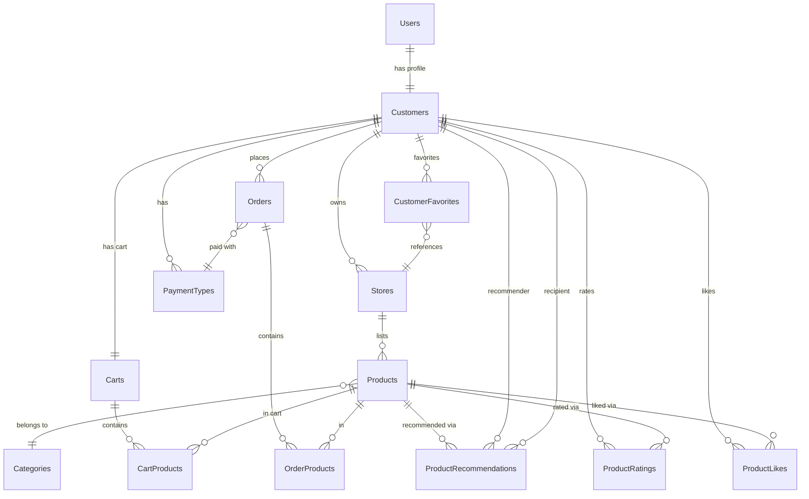

<!-- Last updated: 2026-05-23 -->
<!-- Last change: Updated data model for Cart/Order separation (ticket #60) -->

# Bangazon Client - Technical Architecture

## System Overview

The Bangazon client is a Next.js single-page application that communicates with a Django REST API. There is no server-side rendering in use; all data fetching happens client-side after the initial page load.



## Codebase Map

```
bangazon-client/
├── pages/                  # Next.js routes (one file = one URL)
│   ├── _app.js             # App entry point; applies per-page layouts
│   ├── index.js            # / → renders Products page
│   ├── login.js            # /login
│   ├── register.js         # /register
│   ├── profile.js          # /profile — favorites, recommendations, likes
│   ├── cart.js             # /cart — current open order
│   ├── my-orders.js        # /my-orders — completed order history
│   ├── payments.js         # /payments — payment type management
│   └── products/
│   │   ├── index.js        # /products — list with filter
│   │   ├── new.js          # /products/new — create product form
│   │   └── [id]/
│   │       ├── index.js    # /products/:id — product detail
│   │       └── edit.js     # /products/:id/edit — edit product form
│   └── stores/
│       ├── index.js        # /stores — store listing
│       ├── new.js          # /stores/new — create store form
│       └── [id]/
│           ├── index.js    # /stores/:id — store detail
│           └── edit.js     # /stores/:id/edit — edit store form
│
├── components/             # Reusable UI components
│   ├── layout.js           # Wraps every page; provides AppWrapper (context)
│   ├── navbar.js           # Top navigation; reads token and profile from context
│   ├── filter.js           # Product filter dropdown (name, category, price, location)
│   ├── card-layout.js      # Generic Bulma card shell with title and footer slots
│   ├── modal.js            # Generic modal wrapper
│   ├── table.js            # Generic table with configurable headers
│   ├── form-elements/      # Reusable input primitives (Input, Select, Textarea)
│   ├── product/            # ProductCard, ProductDetail, ProductForm
│   ├── store/              # StoreCard, StoreDetail, StoreForm
│   ├── order/              # CartDetail, CompleteFormModal
│   ├── rating/             # RatingCard, RatingContainer, RatingDetail, RatingForm, RatingHeader
│   └── payments/           # PaymentModal
│
├── context/
│   └── state.js            # AppContext: token + profile shared state
│
├── data/                   # API service modules (one file per resource)
│   ├── fetcher.js          # Base fetch utility; handles auth errors and redirects
│   ├── settings.js         # Defines apiHost from env var (currently unused by fetcher)
│   ├── auth.js             # login, register, getUserProfile
│   ├── products.js         # CRUD, like, unlike, recommend, rate, add/remove from order
│   ├── orders.js           # getCart, getOrders, completeCurrentOrder
│   ├── stores.js           # CRUD, favorite, unfavorite
│   └── payment-types.js    # getPaymentTypes, addPaymentType, deletePaymentType
│
├── public/images/          # Static assets (logo)
├── global.css              # Global styles; imports Bulma and FontAwesome
└── package.json            # Dependencies: Next.js, React 18, Bulma, FontAwesome, react-simple-star-rating
```

## Entry Points

**App bootstrap:** `pages/_app.js` is the Next.js entry point. It checks each page component for a `getLayout` function and applies it. If no `getLayout` is defined, the page renders without a layout.

**Layout pattern:** Every page defines its own `getLayout` at the bottom of the file:

```js
MyPage.getLayout = function getLayout(page) {
  return (
    <Layout>
      <Navbar />
      {page}
    </Layout>
  )
}
```

**Context bootstrap:** `components/layout.js` wraps its children in `<AppWrapper>`. This means context (`token`, `profile`) is only available on pages that include `<Layout>` in their `getLayout`. Login and register pages include Layout, so they have access to `setToken`.

**Auth flow:** On app load, `context/state.js` reads `token` from `localStorage`. When `token` is set, it fetches the user profile from `GET /my-profile` and stores it in context. A 401 response from any API call redirects the browser to `/login`.

## Component Breakdown

### Pages
Each page is responsible for fetching its own data on mount via `useEffect`. Data is stored in local `useState`. Pages pass data and callbacks down to components as props. There is no shared data-fetching layer beyond the `data/` service modules.

### Shared Components
- **`Layout`**: Shell for every page. Provides `AppWrapper` (context) and a `<main className="container">` wrapper.
- **`Navbar`**: Reads `token` and `profile` from `AppContext`. Shows login/register buttons when logged out, and a profile dropdown (cart, orders, payments, profile, store links) when logged in.
- **`Filter`**: Product search and filter UI. Builds a query string from its refs and calls an `onSearch` callback passed in from the products page. **Note:** categories are currently hardcoded as dummy fruit names; ticket #7 requires fetching real categories from the API.
- **`form-elements/`**: Thin wrappers around `<input>`, `<select>`, and `<textarea>` that accept a `ref` prop (uncontrolled inputs). Used across product, store, and auth forms.

### Data Layer (`data/`)
Each module corresponds to one backend resource. Functions call `fetchWithResponse` (returns parsed JSON) or `fetchWithoutResponse` (used for mutations that return no body). All authenticated calls read `localStorage.getItem('token')` directly and pass it as the `Authorization: Token <token>` header.

`fetcher.js` is the only place that knows the API base URL (`http://localhost:8000`, hardcoded). It handles two error cases globally: 401 redirects to `/login`, and 404 re-throws the error for the caller to handle.

### AppContext (`context/state.js`)
Provides four values to the component tree: `token`, `setToken`, `profile`, `setProfile`. Components call `useAppContext()` to read these. The TanStack Query learning spike (ticket #35) will investigate replacing parts of this with server-state caching.

## Data Model

Full schema is in [dev-docs/erd.dbml](erd.dbml). The diagram below shows key relationships.



## API Design

**Base URL:** `http://localhost:8000` (hardcoded in `data/fetcher.js`)

**Auth:** Token-based. After login, the server returns `{ token: "..." }`. The token is stored in `localStorage` and sent on every request as `Authorization: Token <token>`.

### Endpoints the client currently calls

| Method | URL | Used by |
|--------|-----|---------|
| POST | `/login` | `data/auth.js` |
| POST | `/register` | `data/auth.js` |
| GET | `/my-profile` | `data/auth.js` |
| GET | `/products` | `data/products.js` |
| GET | `/products?<query>` | `data/products.js` (filter) |
| GET | `/products/:id` | `data/products.js` |
| POST | `/products` | `data/products.js` |
| PUT | `/products/:id` | `data/products.js` |
| DELETE | `/products/:id` | `data/products.js` |
| POST | `/products/:id/add_to_order` | `data/products.js` |
| DELETE | `/products/:id/remove-from-order` | `data/products.js` (see note below) |
| POST | `/products/:id/rate-product` | `data/products.js` |
| POST | `/products/:id/recommend` | `data/products.js` |
| POST | `/products/:id/like` | `data/products.js` |
| DELETE | `/products/:id/unlike` | `data/products.js` (see note below) |
| GET | `/categories` | `data/products.js` |
| GET | `/cart` | `data/orders.js` |
| GET | `/orders` | `data/orders.js` |
| PUT | `/orders/:id` | `data/orders.js` |
| GET | `/stores` | `data/stores.js` |
| GET | `/stores/:id` | `data/stores.js` |
| POST | `/stores` | `data/stores.js` |
| PUT | `/stores/:id` | `data/stores.js` |
| POST | `/stores/:id/favorite` | `data/stores.js` |
| DELETE | `/stores/:id/unfavorite` | `data/stores.js` |
| GET | `/payment-types` | `data/payment-types.js` |
| POST | `/payment-types` | `data/payment-types.js` |
| DELETE | `/payment-types/:id` | `data/payment-types.js` |

**Known API URL mismatches (tickets to address):**
- `removeProductFromCart` calls `/products/:id/remove-from-order`; ticket #29 expects the endpoint to be `/lineitems/:id`
- `unLikeProduct` calls `/products/:id/unlike` with DELETE; ticket #20 specifies `/products/:id/like` with DELETE

## Infrastructure and Deployment

This project runs entirely on localhost during development. There is no production deployment or hosting planned.

| Service | URL | How to start |
|---------|-----|--------------|
| Next.js client | `http://localhost:3000` | `npm run dev` |
| Django REST API | `http://localhost:8000` | Managed in backend repo |

Both repos must be running simultaneously for the client to function. The client has no proxy or environment-based switching; the API URL is hardcoded in `data/fetcher.js`.

## Key Technical Decisions

- **Pages Router, not App Router:** The project uses Next.js Pages Router (`pages/` directory). The App Router (Next.js 13+) is not used. This is relevant for the TanStack Query spike since the integration pattern differs between the two routers.
- **Per-page layout pattern:** Instead of a single global layout in `_app.js`, each page declares its own `getLayout`. This gives per-page control over layout but means `AppContext` is only available inside pages that wrap themselves in `<Layout>`.
- **Uncontrolled form inputs:** Forms use `useRef` rather than `useState` for input values. This keeps form state local and avoids re-renders on keystrokes, but means you can't reactively validate or pre-populate fields as easily.
- **Token in localStorage:** The auth token is stored in `localStorage` and read directly in each `data/` module rather than being threaded through context. This works but means the data layer is coupled to `localStorage` directly.
- **No TypeScript:** The project is plain JavaScript. Ticket #36 is a learning spike to explore TypeScript; full conversion is out of scope.

## Project Conventions

### Testing
No frontend tests are currently present. All testing described in the working agreement is manual: run the dev server and verify behavior in the browser before opening a PR.

### Code Style
- Functional components only; no class components
- `useRef` for form inputs (uncontrolled); `useState` for UI state (loading, visibility toggles)
- One default export per file; named exports for utilities (e.g., `form-elements/index.js` re-exports all form primitives)
- Bulma CSS utility classes used directly in JSX; no CSS modules or styled components

### Commits and PRs
Defined in `PROJECT_WORKFLOW.md`. Branch naming: `initials/short-description-ticket-#`. PRs merge into `dev`, not `main`.

## Unanswered Questions

- **`data/settings.js` is unused:** It exports `apiHost: process.env.REACT_APP_API_URI`, but `fetcher.js` ignores it and hardcodes `http://localhost:8000`. It's unclear if this was meant to be wired up but never was, or if it's leftover from an earlier version. Next.js also requires the `NEXT_PUBLIC_` prefix for client-side env vars, not `REACT_APP_`, so it wouldn't work as-is even if fetcher.js imported it.
